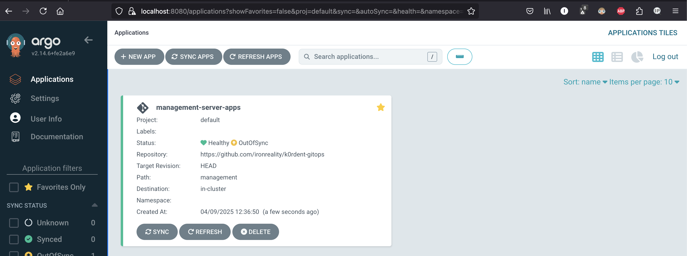
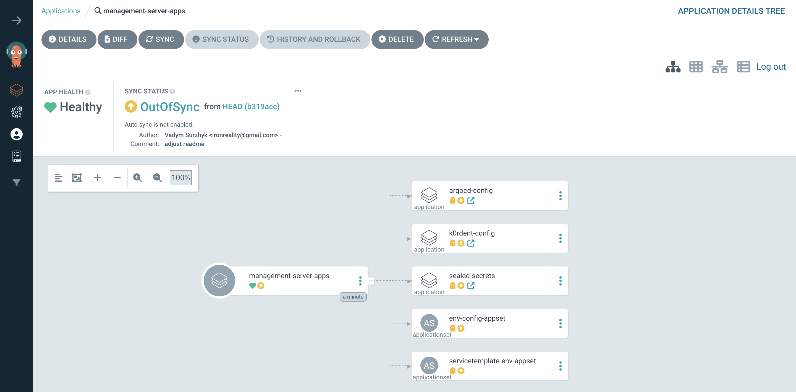
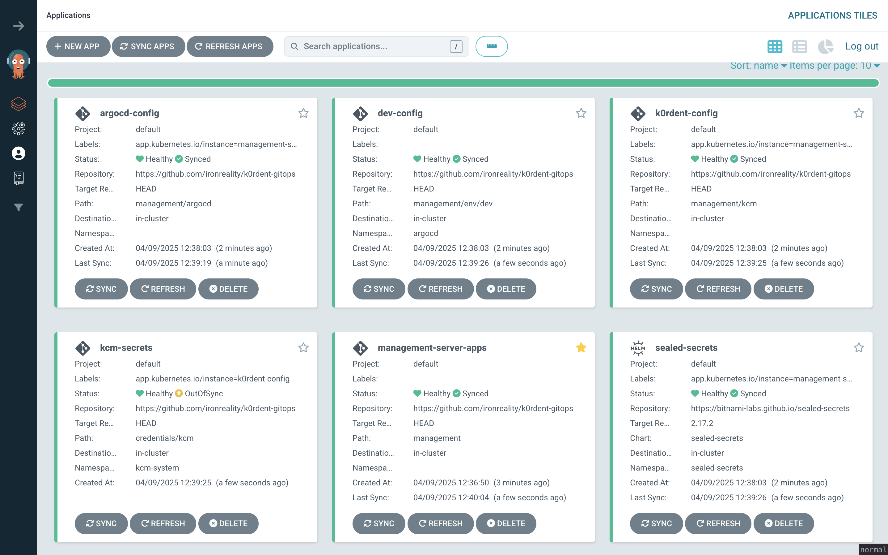
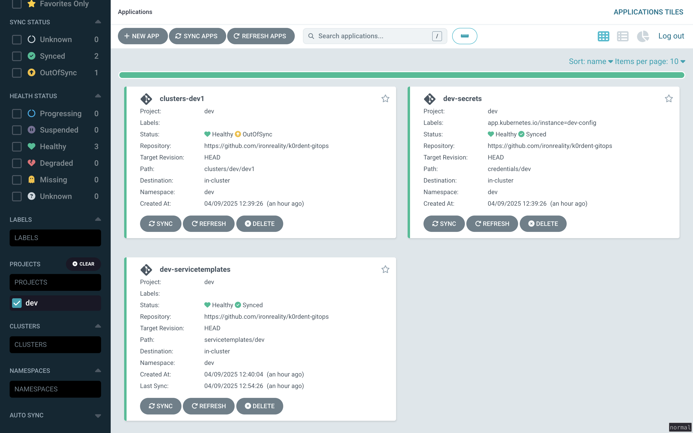

# k0rdent multi-env gitops repo blueprint

## Table of content

<!-- toc -->

- [Repo structure](#repo-structure)
- [Bootstrap k0rdent management cluster](#bootstrap-k0rdent-management-cluster)
- [Cluster credentials encryption using sealed-secrets](#cluster-credentials-encryption-using-sealed-secrets)
- [SSO OIDC setup (Okta-based)](#sso-oidc-setup-okta-based)
  * [Setup OIDC for kind-based management cluster](#setup-oidc-for-kind-based-management-cluster)
  * [Setup OIDC for argocd](#setup-oidc-for-argocd)

<!-- tocstop -->

## Repo structure
```
/
├── clusters            # child clusters' manifests
│   ├── dev             
│   │   └── dev1        # dev/dev1 cluster manifest
│   ├── stage
│   └── (prod)
│       
├── credentials         # child clusters platform credentials
│   ├── base 
│   ├── kcm             # kcm-system namespace secrets
│   ├── dev
│   ├── stage
│   └── (prod)
│       
├── servicetemplates    # beach head servicetemplates
│   ├── base 
│   ├── dev
│   ├── stage
│   └── (prod)
│       
├── services            # beach head services configs
│   ├── cert-manager
│   │   ├── base
│   │   ├── dev
│   │   ├── stage
│   │   └── (prod)
│   ...    
│   ├── ingress-nginx
│   ├── cert-manager
│   ├── kof-storage
│   ├── kof-operators
│   ├── kof-mothership
│   ├── kof-collectors
│   └── dex
│       
├── management          # management cluster's apps & configs
│   ├── kcm             # kcm configs
│   ├── argocd          # argocd configs
│   ├── env             # env-related kcm & argocd configs
│   │   ├── dev
│   │   ├── stage
│   │   └── (prod)
│   ├── env-config-appset.yaml            # per-env configs generator
│   ├── servicetemplate-env-appset.yaml   # per-env servicetemplate generator
│   ├── k0rdent-config-app.yaml           # argocd app for kcm configuration
│   ├── argocd-config-app.yaml            # argocd app for argocd configuration
│   └── sealed-secrets-app.yaml           # argocd app for sealed-secret
│       
├── doc                                   # documentation
└── other                                 # additional scripts, configs etc.
```

## Bootstrap k0rdent management cluster

1. Create the management cluster using kind

**If you're going to configure SSO (OIDC) (which usually a fact for multi-env setups) then create cluster using [SSO OIDC setup (Okta-based)](#sso-oidc-setup-okta-based)**

(You might use any Kubernetes distro for the management cluster instead of kind. For example, [here](https://docs.k0rdent.io/v0.2.0/quickstarts/quickstart-1-mgmt-node-and-cluster/#install-a-single-node-k0s-cluster-locally-as-the-management-cluster) is k0s installation manual from k0rdent documentation.)
```console
kind create cluster -n k0rdent
```

2. Install k0rdent

**To check the installation status view [this doc](https://docs.k0rdent.io/v0.2.0/quickstarts/quickstart-1-mgmt-node-and-cluster/#install-k0rdent)**
```console
helm install kcm oci://ghcr.io/k0rdent/kcm/charts/kcm --version 0.2.0 -n kcm-system --create-namespace
```

3. Create k8s namespaces
```console
for i in argocd dev stage; do kubectl create ns "$i"; done
```

4. Install argocd
```console
kubectl apply -n argocd -f https://raw.githubusercontent.com/argoproj/argo-cd/stable/manifests/install.yaml
```

5. Login to argocd using the port forwarding using the initial password
```console
pass=$(argocd admin initial-password -n argocd | head -n 1)
export ARGOCD_OPTS='--port-forward --port-forward-namespace argocd'
argocd login --insecure --username admin --password "$pass" localhost:8080
```

6. Create the management server configuration using argocd app-of-apps
```console
argocd app create management-server-apps --repo https://github.com/ironreality/k0rdent-gitops --path management --dest-server https://kubernetes.default.svc
```

7. Port-forward the argocd's HTTPS port to access the argocd's web UI
```console
kubectl port-forward svc/argocd-server -n argocd 8080:443
```

8. Open the web UI's URL http://localhost:8080 in browser and sign in using the initial argocd's password from step 5

You should be able to see management-server-apps we created on step 7.




management-server-apps contains all the needed argocd apps to configure k0rdent, argocd and target environments (dev, stage etc.) configurations

**For the sake of simplicity we're using only dev and stage environment in this blueprint.**




9. Sync management-server-apps from argocd's web UI, then sync all the applications appeared.



After sync you'll have "dev" and "stage" projects configured in argocd.



## Cluster credentials encryption using sealed-secrets

We're using [sealed-secrets](https://github.com/bitnami-labs/sealed-secrets) to protect our k0rdent credentials.

sealed-secrets is being installed using **sealed-secrets** argocd's app.
The credentials resides in **credentials/** folder.
You have two choices to get encrypted secrets from the folder unencrypted on the cluster side.

**For new management cluster installation**, you might want to re-encrypt your secrets with the actual encryption key and then push them into the repo - [here is](https://github.com/bitnami-labs/sealed-secrets?tab=readme-ov-file#how-to-use-kubeseal-if-the-controller-is-not-running-within-the-kube-system-namespace) the related document

A cluster secret encryption example:

```console
kubeseal -f aws-cluster-identity-secret.yaml -w aws-cluster-identity-secret-sealed.yaml --controller-namespace=sealed-secrets --controller-name=sealed-secrets
git add aws-cluster-identity-secret-sealed.yaml
git commit -m "update encrypted secret" && git push
```

**Or you might want to use an already existing ecnryption key** - use the master key [backup/restore](https://github.com/bitnami-labs/sealed-secrets?tab=readme-ov-file#how-can-i-do-a-backup-of-my-sealedsecrets) procedure and apply the master key to the new management cluster after you installed sealed-secrets.

```console
# backup keys
kubectl get secret -n sealed-secrets -l sealedsecrets.bitnami.com/sealed-secrets-key -o yaml > master.key

# restore keys
kubectl apply -f master.key
kubectl rollout restart deployment -n sealed-secrets sealed-secrets
```


## SSO OIDC setup (Okta-based)

### Setup OIDC for kind-based management cluster

1. See [kind OIDC with Okta setup guide](https://docs.k0rdent.io/v0.2.0/admin/installation/auth/okta/) for the details.

1. [k0rdent RBAC documentation](https://docs.k0rdent.io/v0.2.0/admin/access/rbac/)

1. Actual configs being used:<br>
kind cluster config - [kind-config.yaml](./other/kind-config.yaml)<br>
kind cluster authenticaiton config - [authentication-config.yaml](./other/authentication-config.yaml)


### Setup OIDC for argocd

Argocd OIDC setup has already been configured within the repo manifest. Use the docs below for better understanding and adjusting your setup.

1. [Configure OIDC for argocd](https://argo-cd.readthedocs.io/en/stable/operator-manual/user-management/#existing-oidc-provider)
1. Argocd RBAC documentation<br>
[argocd global RBAC documentation](https://argo-cd.readthedocs.io/en/stable/operator-manual/rbac/)<br>
[argocd per-project RBAC documentation](https://argo-cd.readthedocs.io/en/stable/user-guide/projects/#project-roles)
3. Actual configs being used:<br>
argocd global config manifest - [argocd-cm.yaml](./management/argocd/argocd-cm.yaml)<br>
argocd global RBAC config manifest - [argocd-rbac-cm.yaml](./management/argocd/argocd-rbac-cm.yaml)<br>
argocd per-project RBAC manifest example ("dev" project) - [argocd-project.yaml](./management/env/dev/argocd-project.yaml)
